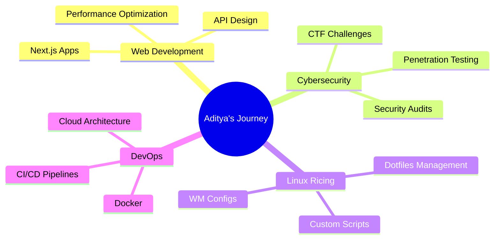

<div align="center">

<!-- ANIMATED HEADER -->


<!-- TYPING ANIMATION -->
<p>
  
</p>

<!-- PROFILE VIEWS & SOCIAL BADGES -->
<p>
  
  
  
</p>

<!-- ANIMATED BANNER -->


</div>

---

## 🚀 About Me

```typescript
const aditya = {
    location: "Delhi, India 🇮🇳",
    role: "Full Stack Developer & Cybersecurity Enthusiast",
    currentFocus: ["System Administration", "Web3", "DevOps"],
    learning: ["Kubernetes", "Rust", "Penetration Testing"],
    hobbies: ["Linux Ricing", "Open Source", "CTF Challenges"],
    motto: "Code. Rice. Repeat. 🔄"
};
```

<div align="center">

### 🌟 Quick Highlights

<table>
<tr>
<td align="center" width="25%">

<br><strong>Full Stack Dev</strong>
<br><sub>Building scalable apps</sub>
</td>
<td align="center" width="25%">

<br><strong>Security Focused</strong>
<br><sub>Ethical hacking & CTFs</sub>
</td>
<td align="center" width="25%">

<br><strong>Linux Ricer</strong>
<br><sub>Customizing everything</sub>
</td>
<td align="center" width="25%">

<br><strong>Always Learning</strong>
<br><sub>Growing every day</sub>
</td>
</tr>
</table>

</div>

---

## 💻 Tech Stack

<details open>
<summary><b>🎨 Frontend Development</b></summary>
<br>


</details>

<details open>
<summary><b>⚙️ Backend Development</b></summary>
<br>


</details>

<details open>
<summary><b>🗄️ Databases</b></summary>
<br>


</details>

<details open>
<summary><b>🔧 DevOps & Tools</b></summary>
<br>


</details>

<details open>
<summary><b>☁️ Cloud & Deployment</b></summary>
<br>


</details>

<details>
<summary><b>📊 Big Data & Analytics</b></summary>
<br>


</details>

---

## 📊 GitHub Analytics

<div align="center">
  
  
</div>

<div align="center">
  
  
</div>

### 🏆 GitHub Trophies
<p align="center">
  
</p>

---

## 🎯 Current Focus



---

## 🎮 When I'm Not Coding

<div align="center">

| 🎵 Music | 🎮 Gaming | 🖥️ Ricing | 📚 Learning |
|:---:|:---:|:---:|:---:|
|  |  |  |  |

</div>

---

## 💬 Random Dev Wisdom

<div align="center">
  
</div>

---

## 😄 Dev Humor Break

<div align="center">
  
</div>

---

## 🤝 Let's Connect

<div align="center">

[](https://your-portfolio.com)
[](https://linkedin.com/in/yourprofile)
[](https://twitter.com/yourhandle)
[](https://discord.gg/yourserver)
[](mailto:your.email@example.com)

</div>

---

## ☕ Support My Work

<div align="center">

If you like what I do, consider buying me a coffee! ☕

[](https://buymeacoffee.com/yourprofile)
[](https://ko-fi.com/yourprofile)

</div>

---

<div align="center">

### 💭 Thought of the Day

*"Code is like humor. When you have to explain it, it's bad."* – Cory House

### 🐍 Contribution Snake

<picture>
  <source media="(prefers-color-scheme: dark)" srcset="https://raw.githubusercontent.com/Im-diablo/Im-diablo/output/github-contribution-grid-snake-dark.svg">
  <source media="(prefers-color-scheme: light)" srcset="https://raw.githubusercontent.com/Im-diablo/Im-diablo/output/github-contribution-grid-snake.svg">
  
</picture>

---


**Made with ❤️ and lots of ☕**

</div>
