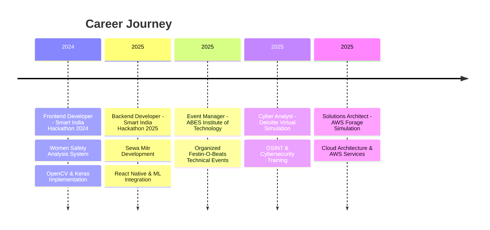

<div align="center">

<!-- ANIMATED HEADER -->


<!-- TYPING ANIMATION -->
<p>
  
</p>

<!-- PROFILE VIEWS & SOCIAL BADGES -->
<p>
  
  
  
</p>

<!-- ANIMATED BANNER -->


</div>

---

## 🚀 About Me

```typescript
const aditya = {
    location: "Ghaziabad, India 🇮🇳",
    education: "B.Tech CSE @ ABES Institute of Technology",
    role: "Full Stack Developer & Blockchain Enthusiast",
    currentFocus: ["Web3 Development", "React Native", "Cloud Architecture"],
    achievements: [
        "Smart India Hackathon 2024 & 2025 Finalist",
        "AWS Solutions Architect Virtual Simulation",
        "Deloitte Cyber Analyst Simulation"
    ],
    learning: ["Solidity", "AWS", "Machine Learning", "Cybersecurity"],
    contact: "adit200515@gmail.com",
    motto: "Building the future, one commit at a time 🔥"
};
```

<div align="center">

### 🌟 Quick Highlights

<table>
<tr>
<td align="center" width="25%">

<br><strong>Full Stack Developer</strong>
<br><sub>MERN + React Native</sub>
</td>
<td align="center" width="25%">

<br><strong>Blockchain Dev</strong>
<br><sub>Solidity & Ethers.js</sub>
</td>
<td align="center" width="25%">

<br><strong>Cyber Analyst</strong>
<br><sub>OSINT & Security</sub>
</td>
<td align="center" width="25%">

<br><strong>SIH Finalist</strong>
<br><sub>2024 & 2025</sub>
</td>
</tr>
</table>

</div>

---

## 💻 Tech Stack & Skills

<details open>
<summary><b>👨‍💻 Programming Languages</b></summary>
<br>


</details>

<details open>
<summary><b>🎨 Frontend Development</b></summary>
<br>


</details>

<details open>
<summary><b>⚙️ Backend & Database</b></summary>
<br>


</details>

<details open>
<summary><b>⛓️ Blockchain & Web3</b></summary>
<br>


</details>

<details open>
<summary><b>🤖 AI/ML & Data Science</b></summary>
<br>


</details>

<details open>
<summary><b>☁️ Cloud & DevOps</b></summary>
<br>


</details>

<details open>
<summary><b>🛠️ Tools & IDEs</b></summary>
<br>


</details>

<details>
<summary><b>💼 Soft Skills</b></summary>
<br>

`Leadership` • `Team Collaboration` • `Problem Solving` • `Communication` • `Time Management` • `Adaptability` • `Event Management`

</details>

---

## 📊 GitHub Analytics

<div align="center">
  
  
</div>

<div align="center">
  
  
</div>

### 🏆 GitHub Trophies
<p align="center">
  
</p>

---

## 🎯 Featured Projects

<div align="center">

### 🏙️ Sewa Mitr - Civic Issue Resolution Platform
[](https://github.com/Im-diablo)

**Tech Stack:** React.js • React Native • Firebase • TypeScript • Node.js • Cloudinary • Google Maps API

```
✅ Full-stack crowdsourced civic reporting system (Web + Mobile)
✅ Intelligent GPS-based issue routing to relevant departments
✅ Real-time tracking and resolution management
✅ Deployed on Vercel with Firebase backend
```

---

### 🗳️ D-Vote - Decentralized Voting System
[](https://github.com/Im-diablo)

**Tech Stack:** Next.js 13 • TypeScript • Solidity • Hardhat • Ethers.js • Supabase • MetaMask • CometChat

```
🔐 Blockchain-based voting with Ethereum smart contracts
🔐 Aadhaar/Voter ID verification & wallet locking
🔐 One-person-one-vote enforcement & anti-fraud measures
🔐 Real-time chat and responsive UI
```

---

### 👁️ Women Safety Analysis System
[](https://github.com/Im-diablo)

**Tech Stack:** Python • OpenCV • Keras • Flask • NumPy • Pandas • Docker

```
🚨 Real-time action recognition using CNN models
🚨 IP camera integration for surveillance
🚨 Automated alert system for critical situations
🚨 SIH 2024 project with successful deployment
```

---

### 🏫 Go School - ERP Management System
[](https://github.com/Im-diablo)

**Tech Stack:** HTML • CSS • JavaScript • PHP • MySQL • Nodemailer

```
📚 Comprehensive school/college management platform
📚 Student, teacher, and admin portal integration
📚 Automated email notifications and reporting
📚 Efficient DBMS implementation
```

</div>

---

## 💼 Professional Experience



---

## 🎓 Education & Certifications

<table align="center">
<tr>
<td align="center" width="33%">

<br><br>
<strong>B.Tech in CSE</strong>
<br>
<sub>ABES Institute of Technology</sub>
<br>
<sub>2023 - 2027</sub>
</td>
<td align="center" width="33%">

<br><br>
<strong>AWS Solutions Architect</strong>
<br>
<sub>Forage Virtual Simulation</sub>
<br>
<sub>2025</sub>
</td>
<td align="center" width="33%">

<br><br>
<strong>Cyber Analyst</strong>
<br>
<sub>Deloitte Virtual Job Simulation</sub>
<br>
<sub>2025</sub>
</td>
</tr>
</table>

---

## 🏆 Achievements

<div align="center">

| 🥇 Achievement | 📅 Year | 📝 Description |
|:--------------|:-------:|:--------------|
| **Smart India Hackathon Finalist** | 2024 | Women Safety Analysis System - Frontend Development |
| **Smart India Hackathon Finalist** | 2025 | Sewa Mitr Civic Reporting - Backend Development |
| **Event Manager** | 2025 | Organized technical events in Festin-O-Beats annual fest |
| **AWS Solutions Architect** | 2025 | Completed Forage virtual job simulation |
| **Cyber Analyst Certification** | 2025 | Completed Deloitte cybersecurity simulation |

</div>

---

## 📈 Coding Profiles

<div align="center">

[](https://leetcode.com/yourprofile)
[](https://codechef.com/users/yourprofile)
[](https://auth.geeksforgeeks.org/user/yourprofile)
[](https://hackerrank.com/yourprofile)

</div>

---

## 🌐 Let's Connect

<div align="center">

[](https://github.com/Im-diablo)
[](https://linkedin.com/in/yourprofile)
[](mailto:adit200515@gmail.com)
[](https://twitter.com/yourhandle)
[](https://discord.gg/yourserver)
[](https://your-portfolio.com)

📍 **Location:** Ghaziabad, India  
📧 **Email:** adit200515@gmail.com  
📱 **Phone:** +91 9717950423

</div>

---

## 💬 Random Dev Wisdom

<div align="center">
  
</div>

---

## 😄 Dev Humor Break

<div align="center">
  
</div>

---

<div align="center">

### 💭 Philosophy

> *"First, solve the problem. Then, write the code."* – John Johnson

### 🐍 Contribution Snake

<picture>
  <source media="(prefers-color-scheme: dark)" srcset="https://raw.githubusercontent.com/Im-diablo/Im-diablo/output/github-contribution-grid-snake-dark.svg">
  <source media="(prefers-color-scheme: light)" srcset="https://raw.githubusercontent.com/Im-diablo/Im-diablo/output/github-contribution-grid-snake.svg">
  
</picture>

---

### ☕ Support My Work

If you find my projects helpful or interesting, consider supporting me!

[](https://buymeacoffee.com/yourprofile)
[](https://ko-fi.com/yourprofile)

---


**Made with ❤️ by Aditya Yadav | Building the future, one commit at a time 🚀**


</div>
